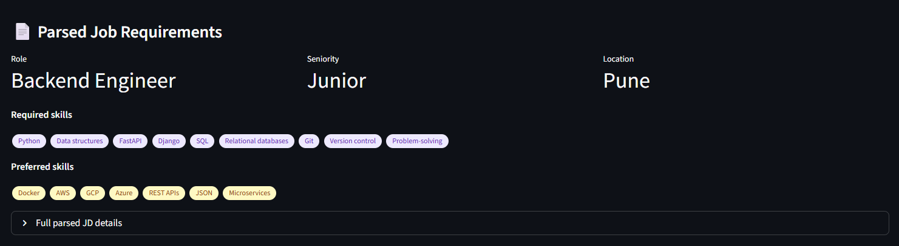
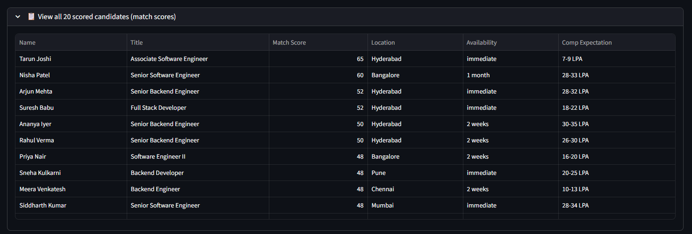
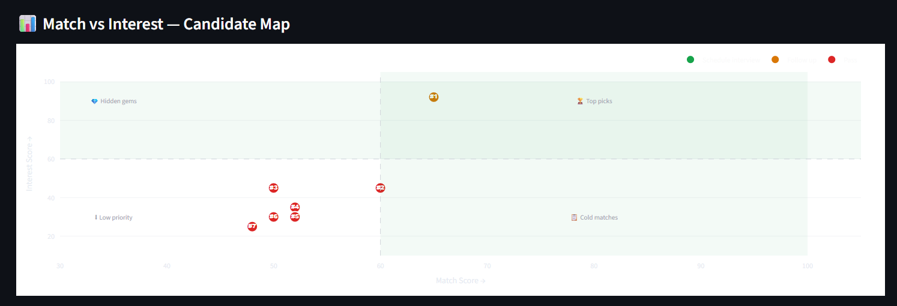
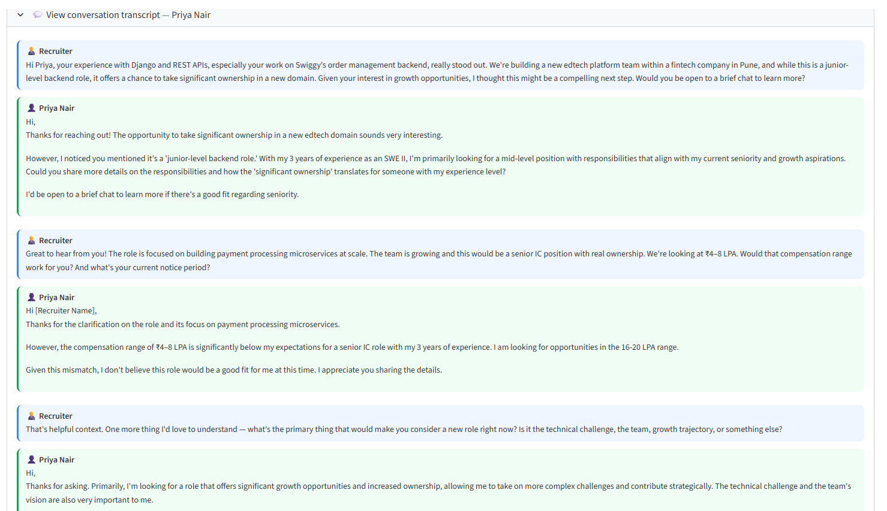

# AI Talent Scouting & Engagement Agent

An AI-powered recruiter agent built with **LangGraph** that takes a Job Description as input, discovers matching candidates, engages them conversationally to assess genuine interest, and outputs a ranked shortlist scored on two dimensions: **Match Score** and **Interest Score**. Works with any major LLM provider (Claude, OpenAI, Gemini) via simple API key configuration.

---

## Architecture

```
JD Input
   │
   ▼
┌─────────────┐     ┌──────────────────┐     ┌──────────────────┐
│  jd_parser  │────►│ candidate_matcher│────►│  filter_top_n    │
│             │     │  (20 profiles)   │     │  (top N, ≥40 score)│
└─────────────┘     └──────────────────┘     └────────┬─────────┘
                                                       │
                                                       ▼
┌──────────────────┐     ┌──────────────┐     ┌──────────────────┐
│shortlist_formatter│◄───│scorer_ranker │◄────│engagement_agent  │
│  (LLM summaries) │     │  (pure math) │     │  (6-turn convo)  │
└──────────────────┘     └──────────────┘     └──────────────────┘
         │
         ▼
   Ranked Shortlist UI (Streamlit)
```

**AgentState** — a typed TypedDict — flows through every node. Each node reads the fields it needs and writes back its output fields only.

---

## Node descriptions

**jd_parser** — Uses the configured LLM's structured output (Pydantic) to extract required_skills, seniority_level, must_haves, compensation, and a plain-English summary from raw JD text. Works with Claude, OpenAI, Gemini, or any supported provider.

**candidate_matcher** — Scores all profiles against the parsed JD using the configured LLM. Produces a Match Score (0–100) plus explainability bullets (match reasons and gaps) per candidate. Calls the MockProfileMCP tool layer. Provider-agnostic through `get_llm()` factory.

**filter_top_n** — Conditional edge node. Filters to candidates with match_score ≥ 40, then takes top N. Prevents the expensive engagement loop from running on clearly unsuitable candidates.

**engagement_agent** — Runs a 6-turn simulated recruiter-candidate conversation for each top candidate. The configured LLM plays both recruiter (personalized outreach) and candidate persona (based on their profile, availability, and comp expectations). Then analyzes the transcript for an Interest Score (0–100) and concrete interest signals. Multi-LLM compatible.

**scorer_ranker** — Pure Python. Computes `composite = α × match + β × interest`, sorts descending, assigns ranks, and determines recommended action (Schedule / Follow up / Pass). No LLM dependency.

**shortlist_formatter** — Generates a 2–3 sentence recruiter briefing per candidate using the configured LLM, referencing their top match reasons, interest level, and recommended action. Works with any provider via `get_llm()`.

---

## Setup

```bash
# 1. Clone and enter the project
git clone <repo-url>
cd talent_agent

# 2. Create a virtual environment
python -m venv venv
source venv/bin/activate   # Windows: venv\Scripts\activate

# 3. Install dependencies
pip install -r requirements.txt

# 4. Edit .env and set you API KEY(use any one of them)
ANTHROPIC_API_KEY=your-api-key
OPENAI_API_KEY=your-api-key
GOOGLE_API_KEY=your-api-key

# 5. Run
streamlit run app.py
```

---

## Swapping mock MCP for a real MCP server

The `MockProfileMCP` class in `tools/mcp_client.py` mimics the interface of a real MCP tool server. To connect a real one:

1. Install the MCP SDK: `pip install mcp`
2. Replace the class body with real MCP client calls:

```python
from mcp import ClientSession, StdioServerParameters
from mcp.client.stdio import stdio_client

server_params = StdioServerParameters(
    command="npx",
    args=["-y", "@your-org/ats-mcp-server"],
    env={"ATS_API_KEY": os.getenv("ATS_API_KEY")}
)
```

3. The node code (`candidate_matcher.py`) calls `MockProfileMCP` and does not need to change — only `mcp_client.py` needs updating.

---

## Sample JD for testing

```
We are looking for a Senior Backend Engineer to join our fintech platform team
in Hyderabad (hybrid). You will design and own microservices handling payment
processing at scale.

Required: 5+ years Python, strong experience with FastAPI or Django, PostgreSQL,
Redis, Docker/Kubernetes. Experience with AWS (ECS, RDS, SQS) is a must.

Nice to have: Kafka, Golang, prior fintech or payments domain experience.

We offer 25-35 LPA depending on experience. Immediate joiners preferred.
```

---

## Scoring formula

```
composite_score = α × match_score + β × interest_score
```

Default: α = 0.6, β = 0.4. Both weights are tunable via the Streamlit sidebar sliders.

| Composite Score | Recommended Action |
|---|---|
| ≥ 75 | Schedule interview |
| 55 – 74 | Follow up |
| < 55 | Pass |

---

## Future Enhancements

The AI Talent Scouting & Engagement Agent is designed for extensibility. Here are planned features for future releases:

### Real-Time Candidate Conversations
- **Live Chat Integration**: Replace simulated conversations with actual real-time messaging through platforms like LinkedIn, email, or SMS
- **Agent-Powered Responses**: Deploy the engagement agent as a live chatbot that recruiters can use to conduct genuine conversations with candidates
- **Multi-Channel Support**: Support for WhatsApp, Slack, and other communication platforms for seamless candidate outreach

### Scalable Candidate Database
- **Database Integration**: Connect to enterprise ATS systems (Greenhouse, Lever, Workday) or custom databases for unlimited candidate pools
- **Advanced Search & Filtering**: Implement vector search, semantic matching, and machine learning-based candidate discovery
- **Data Enrichment**: Automatically pull candidate data from LinkedIn, GitHub, and other professional networks
- **Privacy & Compliance**: GDPR/CCPA compliant data handling with candidate consent management

### Additional Features
- **Analytics Dashboard**: Comprehensive reporting on hiring funnel metrics, time-to-hire, and candidate quality insights
- **A/B Testing**: Test different outreach strategies and conversation flows to optimize engagement rates
- **Integration APIs**: RESTful APIs for integrating with existing HR tech stack and third-party tools
- **Multi-Language Support**: Support for non-English job descriptions and candidate conversations
- **Automated Scheduling**: Direct calendar integration for interview scheduling based on candidate availability

---

## UI Walkthrough

### Parsed Job Requirements
Extract and display structured job requirements from unstructured JD text:
- **Role**: Extracted job title (e.g., Backend Engineer)
- **Seniority Level**: Automatically classified (Junior, Mid, Senior, Lead, Principal)
- **Location**: Geographic preference
- **Required & Preferred Skills**: Color-coded skill chips for easy scanning



### All Scored Candidates (Match Scores)
View all candidates with their match scores against the job description:
- **Name & Title**: Candidate identification
- **Match Score**: AI-calculated relevance (0–100)
- **Location & Availability**: Quick hiring logistics
- **Compensation Expectation**: Salary alignment check



### Match vs Interest — Candidate Map
Interactive scatter plot visualization of the candidate pool:
- **X-Axis**: Match Score (skill fit to JD)
- **Y-Axis**: Interest Score (genuine enthusiasm for role)
- **Color Coding**: 
  - 🟢 **Green**: Top picks (Schedule Interview)
  - 🟠 **Orange**: Follow-up candidates
  - 🔴 **Red**: Low priority (Pass)
  - 🔵 **Blue**: Hidden gems (low match, high interest)



### View Conversation Transcript
Expandable 6-turn simulated recruiter-candidate conversations:
- **Recruiter**: Personalized outreach highlighting relevant experience
- **Candidate**: Authentic responses reflecting their seniority, availability, and salary expectations
- **Insights**: Each transcript reveals:
  - Technical alignment with requirements
  - Interest signals and concerns
  - Compensation fit
  - Growth trajectory alignment



---

